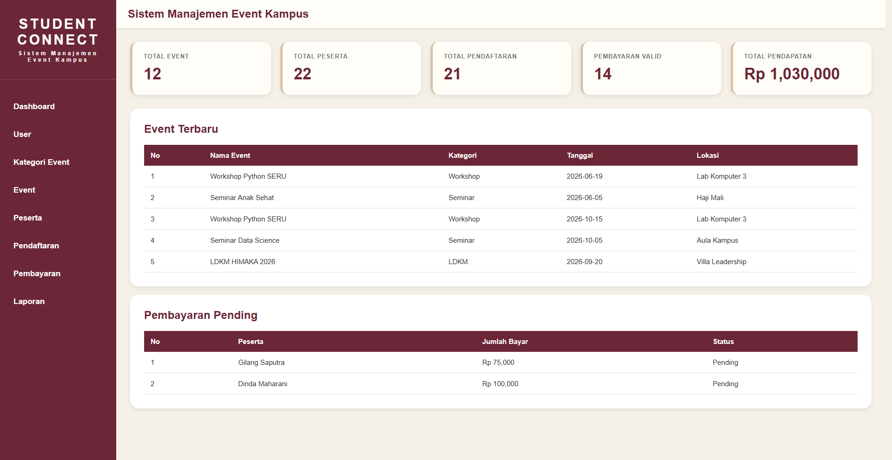
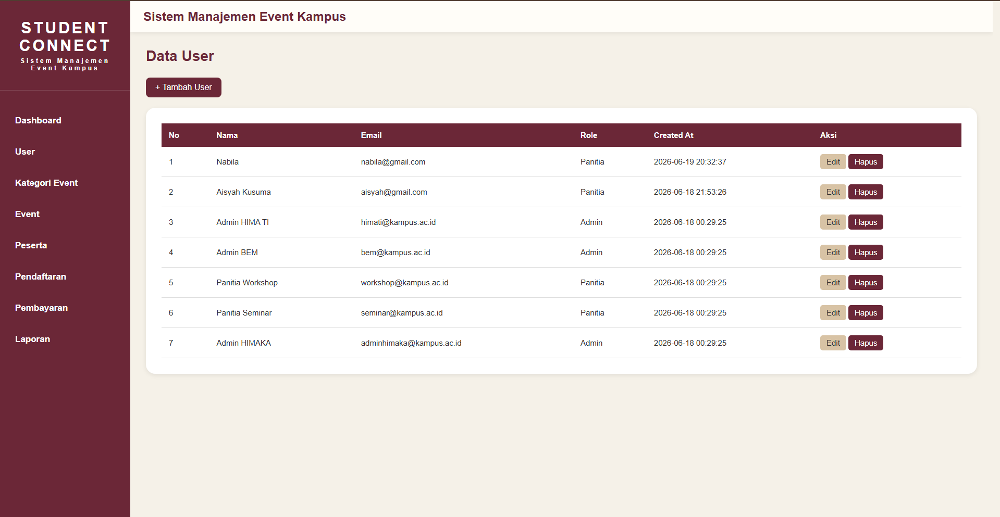
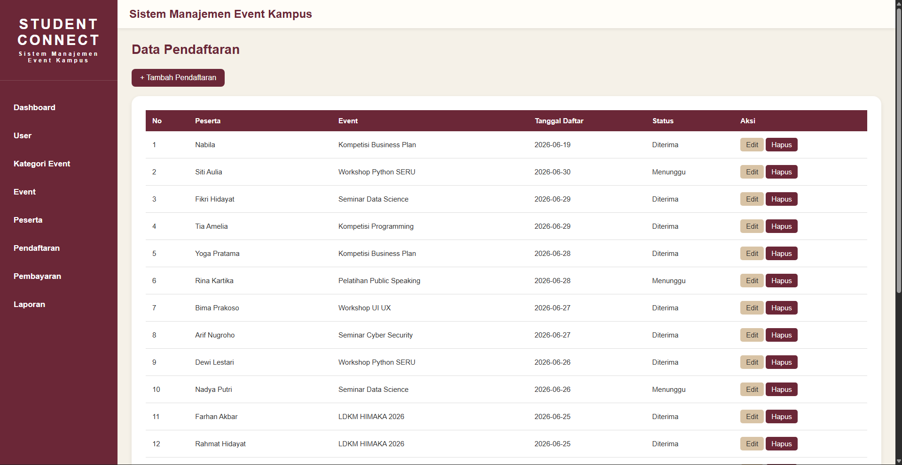
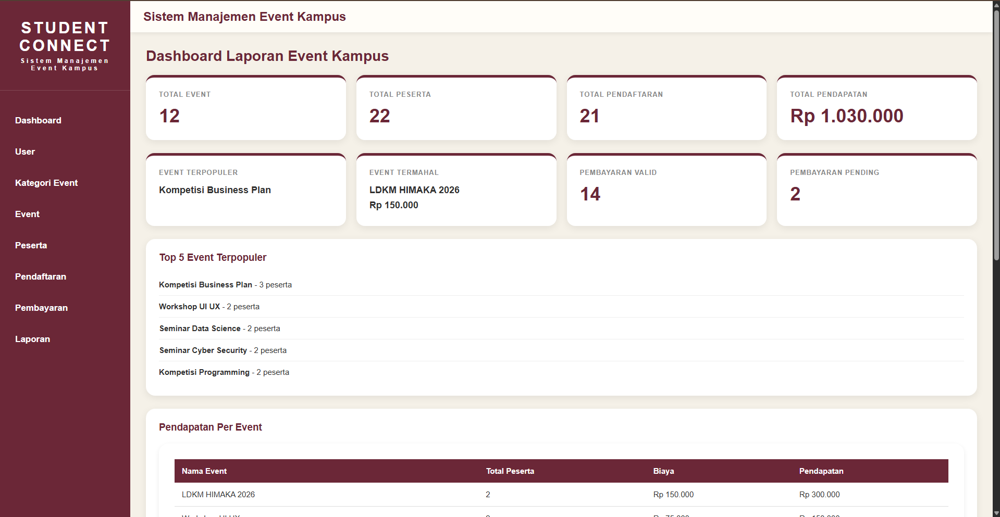

## Fitur Utama & Dokumentasi Antarmuka

### 1. Dashboard Utama (`index.php`)

Dashboard merupakan halaman utama aplikasi yang menampilkan ringkasan informasi sistem secara real-time. Pada halaman ini ditampilkan jumlah event, peserta, pendaftaran, pembayaran valid, serta daftar event terbaru yang telah dibuat.



---

### 2. Manajemen User (`user/index.php`)

Modul ini digunakan untuk mengelola data pengguna sistem. Admin dapat melakukan operasi CRUD (Create, Read, Update, Delete) terhadap data user yang terdaftar.



---

### 3. Manajemen Kategori Event (`kategori/index.php`)

Digunakan untuk mengelompokkan event berdasarkan kategori tertentu seperti seminar, workshop, webinar, maupun kompetisi sehingga data kegiatan lebih terstruktur.


---

### 4. Manajemen Event (`event/index.php`)

Admin dapat mengelola seluruh data kegiatan kampus, meliputi nama event, kategori, tanggal pelaksanaan, lokasi, kuota peserta, dan biaya pendaftaran.


---

### 5. Manajemen Peserta (`peserta/index.php`)

Modul ini digunakan untuk mengelola data peserta yang mengikuti kegiatan kampus. Data peserta dapat ditambahkan, diperbarui, maupun dihapus sesuai kebutuhan.


---

### 6. Pendaftaran Event (`pendaftaran/index.php`)

Berfungsi untuk menghubungkan peserta dengan event yang dipilih. Setiap data pendaftaran akan tersimpan dan dapat dipantau melalui sistem.



---

### 7. Verifikasi Pembayaran (`pembayaran/index.php`)

Digunakan untuk mencatat transaksi pembayaran peserta serta melakukan verifikasi status pembayaran menjadi Valid atau Pending.


---

### 8. Dashboard Laporan (`laporan/index.php`)

Menyajikan berbagai informasi statistik seperti total event, total peserta, total pendaftaran, total pendapatan, event terpopuler, pendapatan per event, dan statistik peserta berdasarkan program studi.



---

## Petunjuk Operasional Menjalankan Aplikasi Secara Lokal

### Prasyarat Sistem

- XAMPP / Laragon / WAMP
- Apache dan MySQL aktif
- PHP 8.0 atau lebih baru

### Langkah Instalasi

#### 1. Salin Source Code

Pindahkan folder project ke direktori:

```text
C:/xampp/htdocs/SIMEKA/
```

#### 2. Import Database

- Buka phpMyAdmin
- Buat database baru:

```sql
simeka
```

- Import file database:

```text
database/simeka.sql
```

#### 3. Konfigurasi Database

Buka file:

```text
config/koneksi.php
```

Sesuaikan konfigurasi:

```php
<?php

$conn = mysqli_connect(
    "localhost",
    "root",
    "",
    "simeka"
);

?>
```

#### 4. Jalankan Aplikasi

Aktifkan Apache dan MySQL melalui XAMPP, kemudian buka:

```text
http://localhost/SIMEKA
```

---

## Struktur Direktori Utama Proyek
```text
📂 SIMEKA/
│
├── 📂 assets/
│   └── style.css
│
├── 📂 config/
│   └── koneksi.php
│
├── 📂 layout/
│   ├── header.php
│   └── sidebar.php
│
├── 📂 user/
├── 📂 kategori/
├── 📂 event/
├── 📂 peserta/
├── 📂 pendaftaran/
├── 📂 pembayaran/
├── 📂 laporan/
│
├── 📂 database/
│   └── simeka.sql
│
├── index.php
│
└── README.md
```
